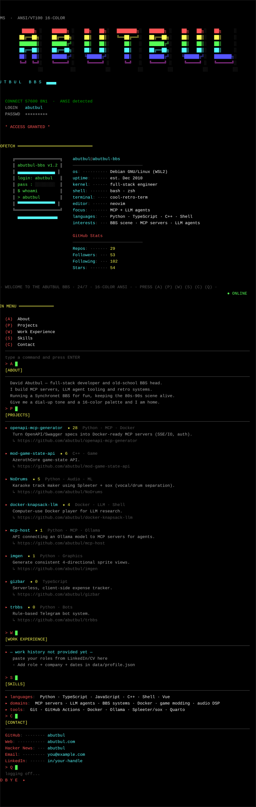

# David Abutbul — <code>abutbul</code> BBS

<i>Full-stack developer · BBS &amp; MCP enthusiast</i>

---

## ▸ MAIN MENU

<code>(A)</code> About · <code>(P)</code> Projects · <code>(W)</code> Work Experience · <code>(S)</code> Skills · <code>(C)</code> Contact · <code>(Q)</code> Quit

<b>(A) About</b>

- David Abutbul — full-stack developer and old-school BBS head.
- I build MCP servers, LLM agent tooling and retro systems.
- Running a Synchronet BBS for fun, keeping the 80s-90s scene alive.
- Give me a dial-up tone and a 16-color palette and I am home.

<b>(P) Projects</b>

<table>
<tr><th>Project</th><th>Description</th><th>Stack</th></tr>
<tr><td><a href="https://github.com/abutbul/openapi-mcp-generator"><b>openapi-mcp-generator</b></a></td><td>Turn OpenAPI/Swagger specs into Docker-ready MCP servers (SSE/IO, auth).</td><td>Python · MCP · Docker</td></tr>
<tr><td><a href="https://github.com/abutbul/mod-game-state-api"><b>mod-game-state-api</b></a></td><td>AzerothCore game-state API.</td><td>C++ · Game</td></tr>
<tr><td><a href="https://github.com/abutbul/NoDrums"><b>NoDrums</b></a></td><td>Karaoke track maker using Spleeter + sox (vocal/drum separation).</td><td>Python · Audio · ML</td></tr>
<tr><td><a href="https://github.com/abutbul/docker-knapsack-llm"><b>docker-knapsack-llm</b></a></td><td>Computer-use Docker player for LLM research.</td><td>Docker · LLM · Shell</td></tr>
<tr><td><a href="https://github.com/abutbul/mcp-host"><b>mcp-host</b></a></td><td>API connecting an Ollama model to MCP servers for agents.</td><td>Python · MCP · Ollama</td></tr>
<tr><td><a href="https://github.com/abutbul/imgen"><b>imgen</b></a></td><td>Generate consistent 4-directional sprite views.</td><td>Python · Graphics</td></tr>
<tr><td><a href="https://github.com/abutbul/gizbar"><b>gizbar</b></a></td><td>Serverless, client-side expense tracker.</td><td>TypeScript</td></tr>
<tr><td><a href="https://github.com/abutbul/trbbs"><b>trbbs</b></a></td><td>Rule-based Telegram bot system.</td><td>Python · Bots</td></tr>
</table>

<b>(W) Work Experience</b>

### — work history not provided yet —
**paste your roles from LinkedIn/CV here**
- Add role + company + dates in data/profile.json

<b>(S) Skills</b>

- **languages**: Python · TypeScript · JavaScript · C++ · Shell · Vue
- **domains**: MCP servers · LLM agents · BBS systems · Docker · game modding · audio DSP
- **tools**: Git · GitHub Actions · Docker · Ollama · Spleeter/sox · Quarto

<b>(C) Contact</b>

- **GitHub**: [abutbul](https://github.com/abutbul)
- **Web**: [abutbul.com](https://abutbul.com)
- **Hacker News**: [abutbul](https://news.ycombinator.com/user?id=abutbul)
- **Email**: [you@example.com](mailto:you@example.com)
- **LinkedIn**: [in/your-handle](https://www.linkedin.com/in/your-handle)

> (Q) Quit → <a href="https://github.com/abutbul">log off</a>

---

 repos 29 · followers 52 · following 102 · stars 53 (live)

ANSI · 80s–90s BBS scene (ACiD/iCE) · generated from code — <code>generator/generate.py</code> · <code>data/profile.json</code>

